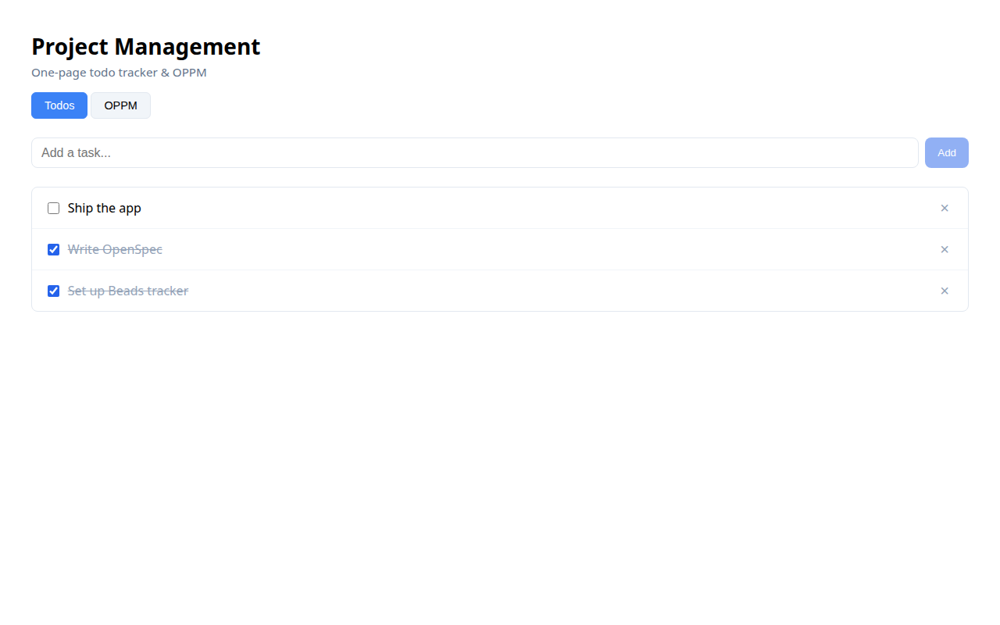
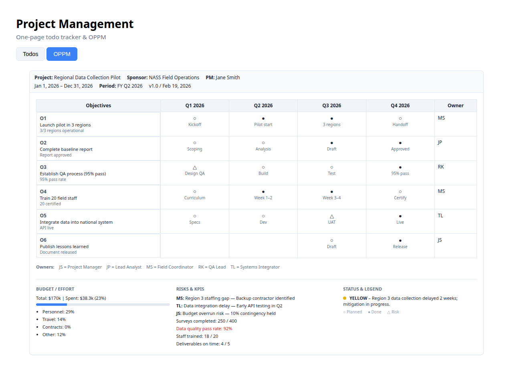
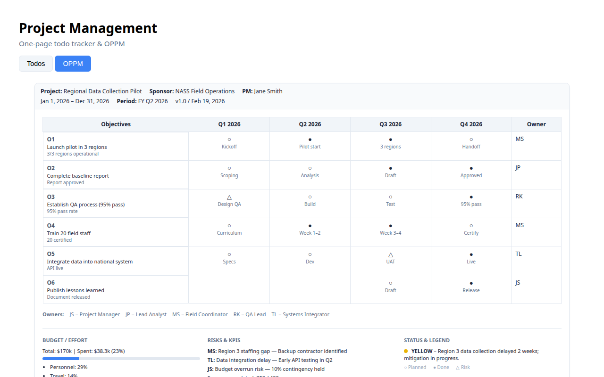

# Project Management App

A simple full-stack one-page project management app built with **Svelte** (frontend), **FastAPI** (backend), and a **vibe coding workflow** using **OpenSpec** and **Beads**.

---

## Project Structure

```
.
├── openspec.md           # Single source-of-truth: architecture, endpoints, data models
├── docs/
│   ├── OPPM-Proposal.md  # OPPM template and proposal
│   └── screenshots/      # Walkthrough screenshots
├── .beads/
│   └── beads.toml        # Beads task tracker (dependencies, status)
├── scripts/
│   ├── bd                # bd ready wrapper
│   └── bd-ready.sh       # List unblocked tasks
├── backend/
│   ├── main.py           # FastAPI app
│   └── requirements.txt
├── frontend/
│   ├── src/
│   │   ├── main.js
│   │   ├── App.svelte
│   │   ├── stores/todos.js
│   │   └── components/
│   │       ├── TodoForm.svelte
│   │       ├── TodoList.svelte
│   │       └── OPPMPage.svelte
│   ├── scripts/
│   │   └── screenshot.js # Capture walkthrough screenshots
│   ├── package.json
│   ├── vite.config.js
│   └── index.html
└── README.md
```

---

## Setup Instructions

### Prerequisites

- Node.js 18+
- Python 3.10+
- (Optional) Rust toolchain for Beads via cargo

### 1. Backend

```bash
cd backend
python3 -m venv .venv       # or: python -m venv .venv
source .venv/bin/activate   # Windows: .venv\Scripts\activate
pip install -r requirements.txt
uvicorn main:app --reload --host 0.0.0.0 --port 8000
```

If venv is unavailable (`ensurepip` missing), use: `pip3 install -r requirements.txt --user` and run `python3 -m uvicorn main:app --reload --port 8000`.

### 2. Frontend

```bash
cd frontend
npm install
npm run dev
```

Open http://localhost:5173

### 3. OpenSpec (optional)

OpenSpec is used here as a **markdown spec** (`openspec.md`). No extra install required.

For OpenSpec CLI/tooling (if available in your ecosystem):

```bash
npm install -g openspec   # If the package exists
```

Otherwise, treat `openspec.md` as the spec. Propose changes there before implementing.

### 4. Beads (progress tracker)

**Option A: Via Cargo (Rust)**

```bash
cargo install beads-cli   # If beads-cli is published
```

**Option B: Pre-built binary**

Download from [Beads releases](https://github.com/beads-dev/beads/releases) (if applicable) and add to PATH.

**Option C: Use the included scripts (no install)**

```bash
chmod +x scripts/bd-ready.sh scripts/bd
./scripts/bd-ready.sh   # Lists unblocked tasks
./scripts/bd ready      # Same, via bd wrapper
```

---

## Running the App

1. **Terminal 1 – Backend**

   ```bash
   cd backend && source .venv/bin/activate && uvicorn main:app --reload --port 8000
   ```

2. **Terminal 2 – Frontend**

   ```bash
   cd frontend && npm run dev
   ```

3. Open **http://localhost:5173** – the app loads mock todos and lets you add/toggle/delete.

---

## Vibe Coding Workflow

### 1. OpenSpec (spec-driven development)

- Edit `openspec.md` to define or change:
  - System architecture
  - Endpoints (method, path, description)
  - Data models (JSON schemas)
  - Validation rules
- Keep it lightweight; avoid over-specifying.

### 2. Beads (progress & dependencies)

- **Query unblocked tasks:** `./scripts/bd-ready.sh` or `bd ready`
- **Update status:** edit `.beads/beads.toml`, set `status = "done"` for completed beads.
- **Add tasks:** append new `[[beads]]` blocks with `id`, `title`, `status`, `deps`.

Example dependency: `frontend-integration` depends on `define-api-routes` and `init-frontend`, so it only becomes ready when both are done.

### 3. Implementation loop

1. **Propose** – change `openspec.md`
2. **Apply** – implement in backend/frontend
3. **Update Beads** – mark beads `status = "done"` as you complete them

---

## AI Agent Usage of Beads

For an AI coding agent:

- **Session memory:** At session start, run `bd ready` to see what’s unblocked.
- **Task selection:** Pick work from the ready list; avoid starting tasks whose dependencies aren’t done.
- **After finishing work:** Update `.beads/beads.toml` – set `status = "done"` for completed beads.
- **New tasks:** Add `[[beads]]` entries with correct `deps` so the graph stays valid.

---

## API Overview

| Method | Path | Description |
|--------|------|-------------|
| GET | `/health` | Health check |
| GET | `/todos` | List all todos |
| GET | `/todos/{id}` | Get one todo |
| POST | `/todos` | Create todo |
| PATCH | `/todos/{id}` | Update todo |
| DELETE | `/todos/{id}` | Delete todo |

See `openspec.md` for full contracts and examples.

---

## Mock Data

The backend starts with 3 sample todos:

- "Ship the app" (pending)
- "Write OpenSpec" (done)
- "Set up Beads tracker" (done)

Data is in-memory; it resets on server restart.

---

## App Walkthrough (with Screenshots)

This section walks through the app using mock data. Start the backend and frontend (see [Running the App](#running-the-app)), then open http://localhost:5173.

### 1. Todos View (default)

The default view shows a simple todo list connected to the FastAPI backend:

- **Add tasks** – Enter a title in the input and click Add
- **Toggle completion** – Check or uncheck items
- **Delete** – Click the × button to remove a task



### 2. OPPM Tab – One Page Project Manager

Click the **OPPM** tab to view the NASS-style One Page Project Manager layout with mock data (Regional Data Collection Pilot).

#### Header block

Project title, sponsor (NASS Field Operations), PM, dates, reporting period (FY Q2 2026), and version.

#### Objectives column + timeline matrix

Six objectives (O1–O6) with a quarterly matrix:

- **○** = planned milestone  
- **●** = completed milestone  
- **△** = risk or decision point  

Each cell shows a short label (e.g., "Kickoff", "Pilot start", "Report draft").



#### Owners

Team initials and roles (JS = PM, JP = Lead Analyst, MS = Field Coordinator, etc.) with owner assigned per objective.

#### Bottom band

- **Budget / Effort** – Total ($170k), spent (23%), bar chart, and % by category
- **Risks & KPIs** – Top 3 risks with mitigation; 4 KPIs (surveys, QA pass rate, staff trained, deliverables)
- **Status & Legend** – Overall status (Green/Yellow/Red) and symbol legend



### Capturing Screenshots

To regenerate the walkthrough screenshots:

```bash
# Terminal 1: Backend
cd backend && python3 -m uvicorn main:app --reload --port 8000

# Terminal 2: Frontend
cd frontend && npm run dev

# Terminal 3: Capture
cd frontend && npm run screenshot
```

Screenshots are saved to `docs/screenshots/`.
