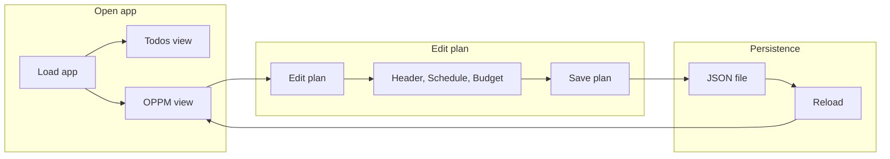
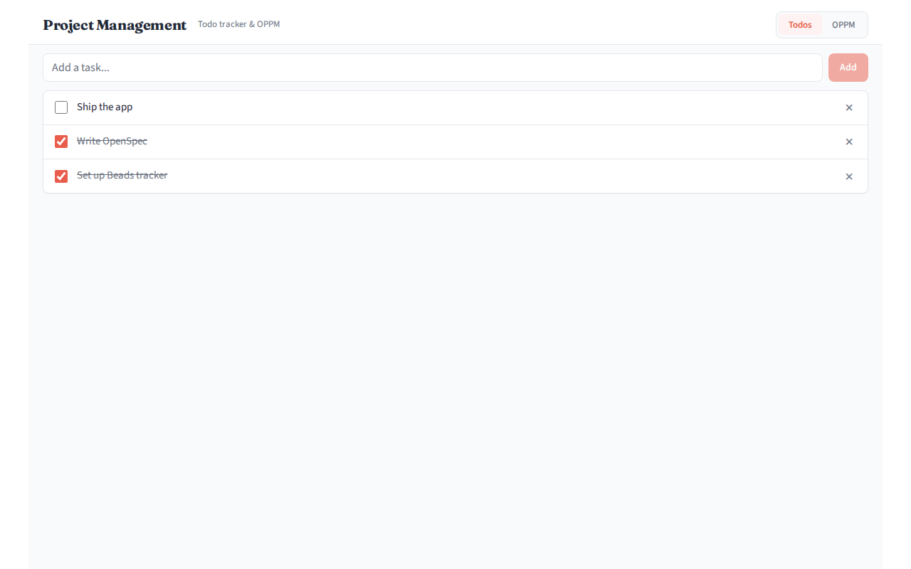
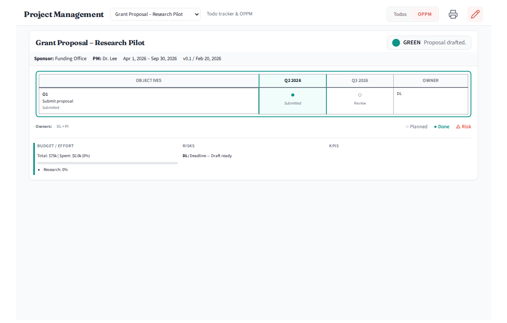
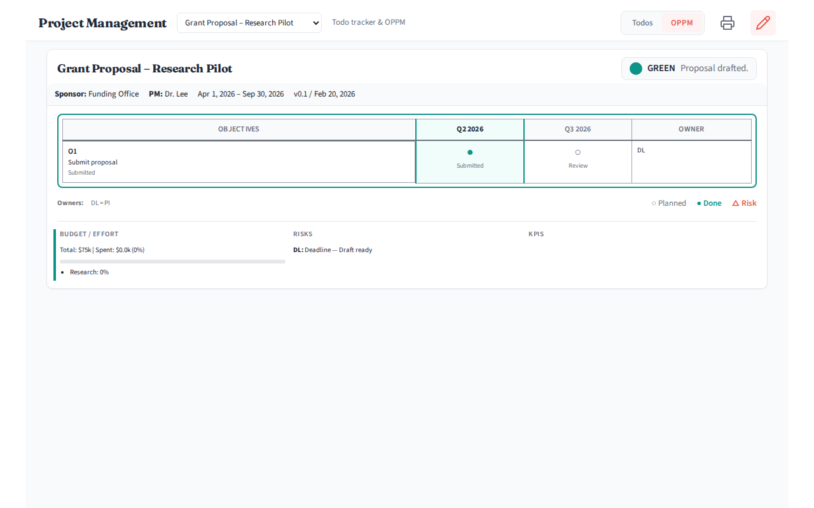
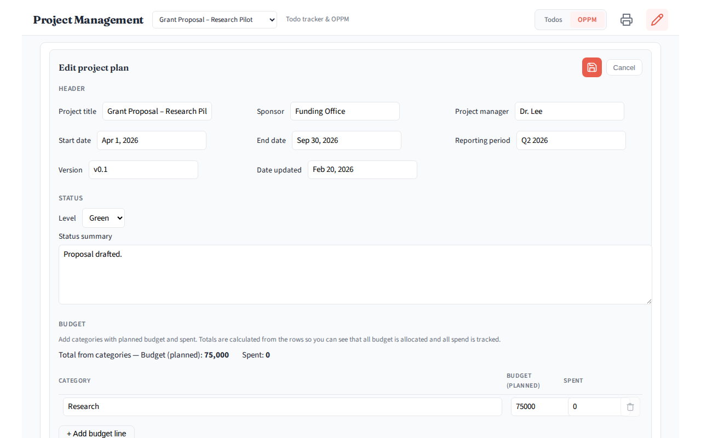
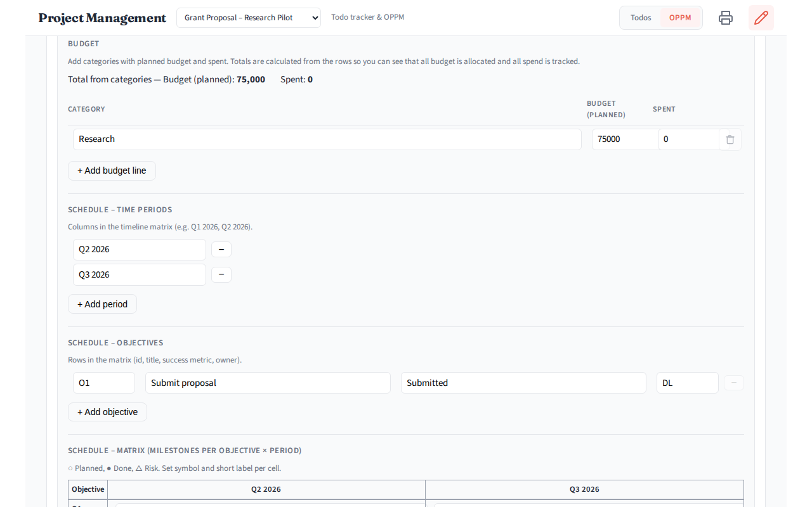

# Project Management App

A simple full-stack one-page project management app built with **Svelte** (frontend), **FastAPI** (backend), and a **vibe coding workflow** using **OpenSpec** and **Beads**.

---

## Project Structure

```
.
├── openspec.md           # Single source-of-truth: architecture, endpoints, data models
├── docs/
│   ├── OPPM-Proposal.md  # OPPM template and proposal
│   └── screenshots/      # Walkthrough screenshots
├── .beads/
│   └── beads.toml        # Beads task tracker (dependencies, status)
├── scripts/
│   ├── bd                # bd ready wrapper
│   └── bd-ready.sh       # List unblocked tasks
├── backend/
│   ├── main.py           # FastAPI app
│   └── requirements.txt
├── frontend/
│   ├── src/
│   │   ├── main.js
│   │   ├── App.svelte
│   │   ├── stores/todos.js
│   │   └── components/
│   │       ├── TodoForm.svelte
│   │       ├── TodoList.svelte
│   │       └── OPPMPage.svelte
│   ├── scripts/
│   │   └── screenshot.js # Capture walkthrough screenshots
│   ├── package.json
│   ├── vite.config.js
│   └── index.html
└── README.md
```

---

## Setup Instructions

### Prerequisites

- Node.js 18+
- Python 3.10+
- (Optional) Rust toolchain for Beads via cargo

### 1. Backend

```bash
cd backend
python3 -m venv .venv       # or: python -m venv .venv
source .venv/bin/activate   # Windows: .venv\Scripts\activate
pip install -r requirements.txt
uvicorn main:app --reload --host 0.0.0.0 --port 8000
```

If venv is unavailable (`ensurepip` missing), use: `pip3 install -r requirements.txt --user` and run `python3 -m uvicorn main:app --reload --port 8000`.

### 2. Frontend

```bash
cd frontend
npm install
npm run dev
```

Open http://localhost:5173

### 3. OpenSpec (optional)

OpenSpec is used here as a **markdown spec** (`openspec.md`). No extra install required.

For OpenSpec CLI/tooling (if available in your ecosystem):

```bash
npm install -g openspec   # If the package exists
```

Otherwise, treat `openspec.md` as the spec. Propose changes there before implementing.

### 4. Beads (progress tracker)

**Option A: Via Cargo (Rust)**

```bash
cargo install beads-cli   # If beads-cli is published
```

**Option B: Pre-built binary**

Download from [Beads releases](https://github.com/beads-dev/beads/releases) (if applicable) and add to PATH.

**Option C: Use the included scripts (no install)**

```bash
chmod +x scripts/bd-ready.sh scripts/bd
./scripts/bd-ready.sh   # Lists unblocked tasks
./scripts/bd ready      # Same, via bd wrapper
```

---

## Running the App

1. **Terminal 1 – Backend**

   ```bash
   cd backend && source .venv/bin/activate && uvicorn main:app --reload --port 8000
   ```

2. **Terminal 2 – Frontend**

   ```bash
   cd frontend && npm run dev
   ```

3. Open **http://localhost:5173** – the app loads mock todos and lets you add/toggle/delete.

---

## App workflow (user)

The main user flow: open app → switch between Todos and OPPM → edit plan (header, schedule, budget) → save → reload to see persisted plan.


```mermaid
flowchart LR
  subgraph open [Open app]
    A[Load app]
    B[Todos view]
    C[OPPM view]
  end
  subgraph edit [Edit plan]
    D[Edit plan]
    E["Header, Schedule, Budget"]
    F[Save plan]
  end
  subgraph persist [Persistence]
    G[JSON file]
    H[Reload]
  end
  A --> B
  A --> C
  C --> D
  D --> E
  E --> F
  F --> G
  G --> H
  H --> C
```

| Step | Action |
|------|--------|
| 1 | Open http://localhost:5173 (or ?view=oppm for OPPM directly). |
| 2 | **Todos:** Add/toggle/delete tasks (in-memory; resets on backend restart). |
| 3 | **OPPM:** View one-page plan (header, objectives × timeline matrix, budget, risks, status). |
| 4 | Click **Edit plan** to open the edit panel (header, time periods, objectives, matrix, budget, status). |
| 5 | Change fields (e.g. project title, add/remove periods or objectives, set matrix symbols/labels). |
| 6 | Click the **save** button (save icon) in the edit panel to persist to the backend JSON file. |
| 7 | Reload the page (or open in a new tab) – the saved plan is loaded. |

Screenshots for the workflow are in [docs/screenshots/](docs/screenshots/) (see [Capturing screenshots](#capturing-screenshots)).

---

## Workflow verification (tests)

Tests use **mock data for different projects** to verify the workflow end-to-end.

### Backend tests (pytest)

- **Location:** `backend/tests/`
- **Fixtures:** Mock plans for Project A (Regional Data Collection Pilot), Project B (IT Migration), Project C (Grant Proposal) – see `conftest.py`.
- **What they verify:** Health; GET /plan returns default when no file; PUT /plan then GET returns saved plan; switching projects (save A, then save B, GET returns B); PUT merges with default.
- **Run:** From repo root, with a virtualenv that has the backend deps and pytest:

  ```bash
  cd backend
  python3 -m venv .venv
  source .venv/bin/activate   # Windows: .venv\Scripts\activate
  pip install -r requirements.txt -r requirements-dev.txt
  pytest tests/ -v
  ```

### E2E tests (Playwright)

- **Location:** `frontend/e2e/workflow.spec.js`
- **What they verify:** Todos view loads; OPPM view loads; Edit plan opens panel with schedule sections; Save plan (via API) and reload shows persisted data in the UI.
- **Run:** Start the **backend** (port 8000) and **frontend** (port 5173), then:

  ```bash
  cd frontend
  npm install
  npx playwright install   # one-time: install browsers
  npm run test:e2e
  ```

  Or let Playwright start the frontend (backend must still be running):

  ```bash
  # Terminal 1: backend
  cd backend && uvicorn main:app --reload --port 8000
  # Terminal 2: e2e (starts frontend if not already running)
  cd frontend && npm run test:e2e
  ```

---

## Vibe Coding Workflow

### 1. OpenSpec (spec-driven development)

- Edit `openspec.md` to define or change:
  - System architecture
  - Endpoints (method, path, description)
  - Data models (JSON schemas)
  - Validation rules
- Keep it lightweight; avoid over-specifying.

### 2. Beads (progress & dependencies)

- **Query unblocked tasks:** `./scripts/bd-ready.sh` or `bd ready`
- **Update status:** edit `.beads/beads.toml`, set `status = "done"` for completed beads.
- **Add tasks:** append new `[[beads]]` blocks with `id`, `title`, `status`, `deps`.

Example dependency: `frontend-integration` depends on `define-api-routes` and `init-frontend`, so it only becomes ready when both are done.

### 3. Implementation loop

1. **Propose** – change `openspec.md`
2. **Apply** – implement in backend/frontend
3. **Update Beads** – mark beads `status = "done"` as you complete them

---

## AI Agent Usage of Beads

For an AI coding agent:

- **Session memory:** At session start, run `bd ready` to see what’s unblocked.
- **Task selection:** Pick work from the ready list; avoid starting tasks whose dependencies aren’t done.
- **After finishing work:** Update `.beads/beads.toml` – set `status = "done"` for completed beads.
- **New tasks:** Add `[[beads]]` entries with correct `deps` so the graph stays valid.

---

## API Overview

| Method | Path | Description |
|--------|------|-------------|
| GET | `/health` | Health check |
| GET | `/plans` | List projects (id, title, projectId, projectNumber) |
| GET | `/plan` | Get one plan. Query `plan_id` for multi-project. |
| PUT | `/plan` | Save plan. Query `plan_id` optional. Body: full plan JSON. |
| GET | `/todos` | List all todos |
| GET | `/todos/{id}` | Get one todo |
| POST | `/todos` | Create todo |
| PATCH | `/todos/{id}` | Update todo |
| DELETE | `/todos/{id}` | Delete todo |

See `openspec.md` for full contracts and examples.

---

## Mock Data

The backend starts with 3 sample todos (in-memory; resets on restart):

- "Ship the app" (pending)
- "Write OpenSpec" (done)
- "Set up Beads tracker" (done)

**OPPM projects:** Use the seed script to create 4 mock projects with unique identifiers:

| Project # | File | Title |
|-----------|------|-------|
| 1001 | `regional-pilot.json` | Regional Data Collection Pilot |
| 1002 | `it-migration.json` | IT Migration Project |
| 1003 | `grant-proposal.json` | Grant Proposal – Research Pilot |
| 1004 | `product-launch.json` | Product Launch – Q2 |

```bash
python3 backend/scripts/seed_plans.py
```

Then start the backend and open the OPPM tab; the plan dropdown will list these projects. Each plan has a **projectId** (UUID) and **projectNumber** (1001–1004) for identification and sharing.

---

## Saving and sharing projects

The app uses **file-based storage** with a **project identifier** so you can host it in the cloud and share JSON across users without a hosted database.

### How it works

- **Storage:** Each project is a JSON file in `backend/data/plans/` (or `PLANS_DIR`). Filename = plan id (e.g. `regional-pilot.json`).
- **Project identifier:** Every plan has:
  - **projectId** – UUID set by the server on first save; uniquely identifies the project when sharing or importing.
  - **projectNumber** – Optional integer (e.g. 1001, 1002) for display; server assigns the next available number if missing.
- **No hosted DB required:** The backend only reads/writes JSON files. You can run it locally, on a VPS, or in a container; multiple users see the same data if they use the same backend (e.g. same server or same shared volume).

### Workflow

1. **Local / single user**  
   Run backend + frontend. Create or edit plans; save. Data lives in `backend/data/plans/`.

2. **Cloud-hosted, shared**  
   Deploy the app (e.g. Fly.io, Railway, or a VM) with a **persistent volume** (or S3-backed storage if you add it). Point `PLANS_DIR` at that volume. Everyone who opens the app uses the same backend and the same JSON files.

3. **Share without hosting**  
   - **Export:** Copy the project JSON file from `PLANS_DIR/<id>.json`, or use GET `/plan?plan_id=<id>` and save the response.
   - **Share:** Send the file (email, drive, link to raw file).
   - **Import:** Put the JSON file into `PLANS_DIR` with a filename that becomes the plan id (e.g. `new-project.json`). The existing **projectId** in the JSON keeps the project uniquely identified; no duplicate IDs if you merge later.

4. **New project**  
   Add a new JSON file in `PLANS_DIR` (or save from the app with a new plan id). The server will assign **projectId** (UUID) and **projectNumber** (next free number) on first save.

### Summary

| Goal | Approach |
|------|----------|
| Run locally | Backend + frontend; data in `backend/data/plans/`. |
| Share across team | Deploy backend with shared volume; everyone uses same URL. |
| Share without central host | Export project JSON; others import the file into their `PLANS_DIR`. |
| Uniquely identify a project | Use **projectId** (UUID) in the JSON; **projectNumber** for human reference. |

---

## Linking from Project-Artifact-Tracker

This app can be used as a **one-page PM / proposal view** linked from [Project-Artifact-Tracker](https://github.com/mowgli42/Project-Artifact-Tracker) (or any tool that stores project links).

- **Direct link to OPPM (print-ready one page):**  
  `http://localhost:5173/?view=oppm`  
  Use this as a project’s **proposal briefing link**, **resources link**, or a custom “One-page PM” field so opening the link shows the OPPM view with budget and schedule highlighted.
- The view is synced with the URL: sharing the link or bookmarking it opens the OPPM tab directly.

---

## Editing and saving the project plan

You can **edit** the one-page plan (header, status, budget) and **save** it so it can be updated later:

- Open the **OPPM** tab, click **Edit plan** (pencil icon in the header), change fields (project title, sponsor, dates, status, budget categories). Budget totals are calculated from category line items so you can see allocated vs spent. Then click the **save** button (save icon) to persist.
- The plan is stored in a **JSON file** by the backend (`backend/data/plan.json` by default; override with env `PLAN_JSON_PATH`). On the next load, the saved plan is used.
- For the full proposal (editing scope, JSON vs SQLite), see [docs/Project-Plan-Persistence-Proposal.md](docs/Project-Plan-Persistence-Proposal.md).

---

## Print-friendly one page

The OPPM view is laid out for **single-page printing** (A4 landscape):

- **Budget** and **schedule** (objectives × timeline matrix) are visually highlighted on screen and in print so key data stands out.
- Use the **Print one page** button on the OPPM tab, or use the browser’s Print (Ctrl/Cmd+P) with the OPPM view open. The app header and tabs are hidden when printing so only the one-page content is printed.

---

## App Walkthrough (with Screenshots)

This section walks through the app using mock data. Start the backend and frontend (see [Running the App](#running-the-app)), then open http://localhost:5173.

### 1. Todos View (default)

The default view shows a simple todo list connected to the FastAPI backend:

- **Add tasks** – Enter a title in the input and click Add
- **Toggle completion** – Check or uncheck items
- **Delete** – Click the × button to remove a task



### 2. OPPM Tab – One Page Project Manager

Click the **OPPM** tab to view the NASS-style One Page Project Manager layout with mock data (Regional Data Collection Pilot).

#### Header block

Project title, sponsor (NASS Field Operations), PM, dates, reporting period (FY Q2 2026), and version.

#### Objectives column + timeline matrix

Six objectives (O1–O6) with a quarterly matrix:

- **○** = planned milestone  
- **●** = completed milestone  
- **△** = risk or decision point  

Each cell shows a short label (e.g., "Kickoff", "Pilot start", "Report draft").



#### Owners

Team initials and roles (JS = PM, JP = Lead Analyst, MS = Field Coordinator, etc.) with owner assigned per objective.

#### Bottom band

- **Budget / Effort** – Total ($170k), spent (23%), bar chart, and % by category
- **Risks & KPIs** – Top 3 risks with mitigation; 4 KPIs (surveys, QA pass rate, staff trained, deliverables)
- **Status & Legend** – Overall status (Green/Yellow/Red) and symbol legend



### 3. Edit plan (workflow)

Click **Edit plan** (pencil icon) on the OPPM tab to open the edit panel. Change header, time periods, objectives, schedule matrix (symbol + label per cell), budget categories (totals are calculated from the rows), and status; then click the **save** button (save icon) to persist.





### Capturing Screenshots

To regenerate the walkthrough screenshots:

```bash
# Terminal 1: Backend
cd backend && python3 -m uvicorn main:app --reload --port 8000

# Terminal 2: Frontend
cd frontend && npm run dev

# Terminal 3: Capture
cd frontend && npm run screenshot
```

Screenshots are saved to `docs/screenshots/` (01–03: walkthrough; 04–05: edit/save workflow).
